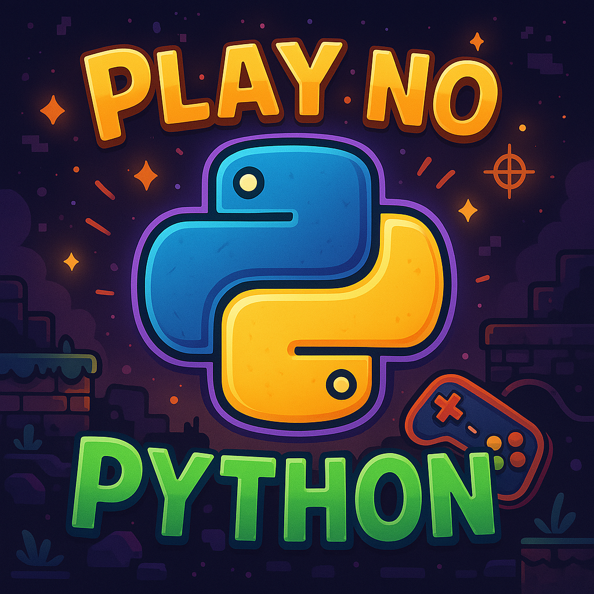

# Projeto Podcast Gerado por I.A.s

Objetivo do projeto, gerar um podcast utilizando de ferramentas de IA através de prompts mais trabalhado.

Utilizando uma esteira de prompts para estar gerando cada etapa do processo criativo.

## 💻 Tecnologias utilizadas no projeto

- Microsoft Copilot
- ElevenLabs
- CapCut

## ✨ Como foi feito ?

- Roteiro gerado através do Microsoft Copilot
- Audio gerado através do ElevenLabs
- Capa gerada atravé do Microsoft Copilot
- Tratamento de audio feito com a ferramenta CapCut para adicinar efeitos sonoros e de fundo

## 📚 Materiais

### Prompt utilizado no Microsoft Copilot para geração de Roteiro
    Você é um roteirista de podcast e estaremos criando um roteiro de um podcast de tecnologia, focado na linguagem Python, cujo nome é “Play no Python - Do nível 0 ao programador +10 em lógica e aventura”, onde o foco para programadores iniciantes na linguagem Python
    O formato do roteiro deve ser
    [INTRODUÇÃO]
    [CURIOSIDADE 1]
    [CURIOSIDADE 2]
    [FINALIZAÇÃO]
    [REGRAS]
    No bloco [INTRODUÇÃO] substitua por uma introdução igual a dos vídeos do canal “Flow games”
    No bloco [CURIOSIDADE 1] substitua por uma curiosidade de Dicionários e Listas
    No bloco [CURIOSIDADE 2] sobre uma ferramenta IDE mais utilizada e como configura-la
    No bloco [FINALIZAÇÃO] substitua por uma despedida cool com o final “Eu sou Gian e esse foi Play no Python dessa semana”
    Use termos de fácil explicação
    O podcast vai ser apresentado somente por uma pessoa, chamada Gian
    O podcast deve ser curto
    [REGRAS NEGATIVAS]
    Não use termos técnicos
    Não ultrapasse 5 minutos de duração

### Prompt utilizado pno Microsoft Copilot para geração da Capa
    Crie uma imagem de capa para o Podcast, utilizando dos elementos do ícone da linguagem Python, sendo criativo no estilo gamer, com alta com qualidade 4k e proporção 1:1

### Audio gerado pela teconologia do ElevenLABS
    
    

### Audio tratado pronto para publicação feito com a ferramenta CapCut
    
    

# 🎙️ Play no Python
## Do nível 0 ao programador +10 em lógica e aventura

> Episódio: **Listas mágicas, dicionários encantados e a IDE que todo herói precisa**
> Apresentação: *Gian*  
> Duração: ⏱️ ~5 minutos

---

### 🔹 INTRODUÇÃO

Salve, salve, meus jovens aventureiros do código! Está no ar mais um episódio do *Play no Python*, o podcast que te guia do básico ao incrível na jornada da programação. Eu sou o Gian, e hoje a missão é leve, divertida e cheia de descobertas! Então pega teu café, senta aí e bora começar essa quest no mundo do Python.

---

### 🐍 CURIOSIDADE 1 — Mochilas e Magias em Python

Você sabia que, no Python, uma **lista** pode guardar várias coisas ao mesmo tempo, igual aquela mochila de RPG que carrega espada, poção e até um pão que ninguém usa?

Agora segura essa: um **dicionário** é como uma mochila encantada que já sabe onde está tudo. Você pergunta “cade a poção?” e ele responde sem nem pensar. É como se fosse uma lista com superpoderes, onde cada item tem um nomezinho que você escolhe.

---

### 💻 CURIOSIDADE 2 — O quartel-general do programador iniciante

Se você tá começando e quer um lugar massa pra escrever seus códigos, o *Visual Studio Code* — ou “VS Code” pros íntimos — é uma das opções mais usadas.

Ele é tipo um caderno digital cheio de poderes: tem marca-texto, lupa, corretor e até um assistente invisível. Depois de instalar, é só abrir a loja de extensões, buscar por “Python” e clicar em instalar. Feito isso, você já tá pronto pra começar a codar com estilo!

---

### 🕹️ FINALIZAÇÃO

E aí, curtiu a jornada de hoje? Se descobriu com as mochilas mágicas do Python e já tá querendo testar seu código? Então missão cumprida!

Se você tá curtindo o podcast, já salva aí nos seus favoritos e compartilha com aquele amigo que acha que programação é coisa de outro mundo. Spoiler: é, mas é muito mais divertido do que parece.

**Eu sou Gian, e esse foi *Play no Python* dessa semana. Até a próxima aventura!**

---

### 📌 Créditos & Referências

- Linguagem Python: [python.org](https://www.python.org/)
- Editor VS Code: [code.visualstudio.com](https://code.visualstudio.com/)

---
